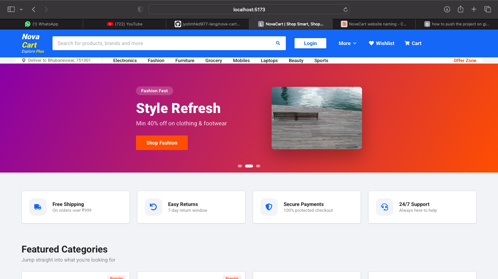
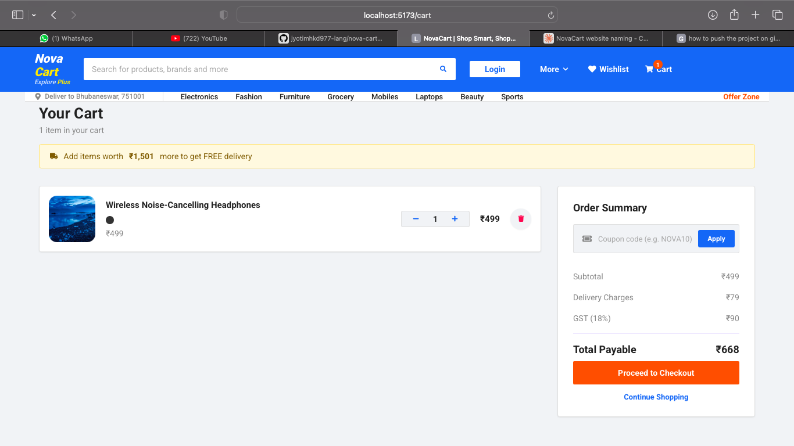
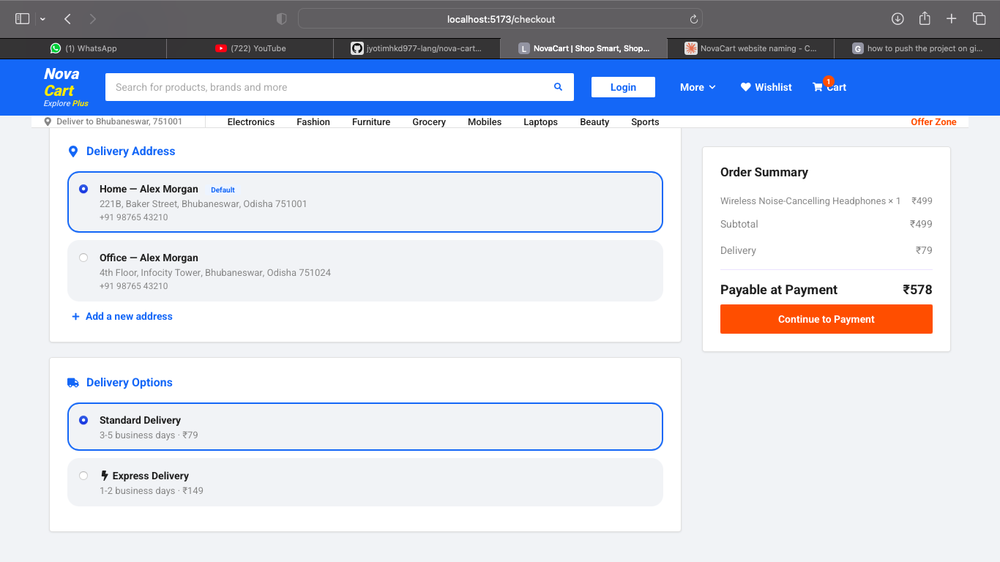
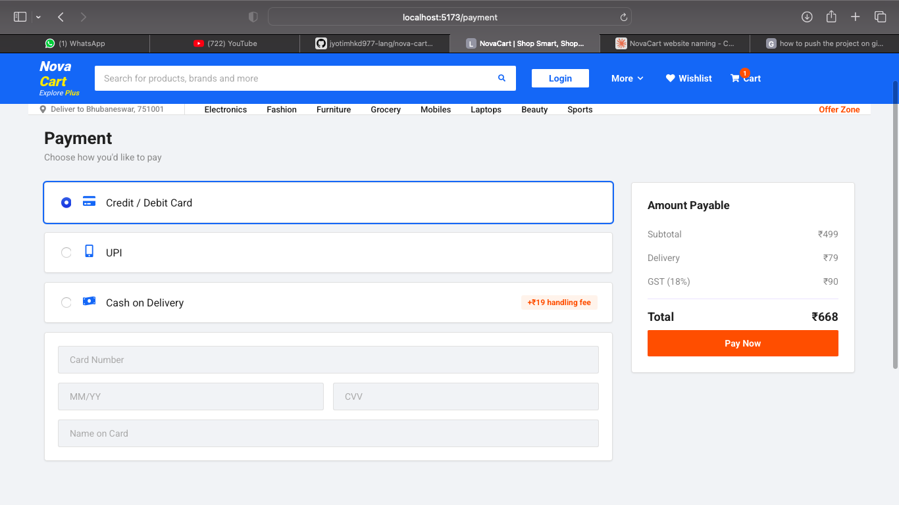
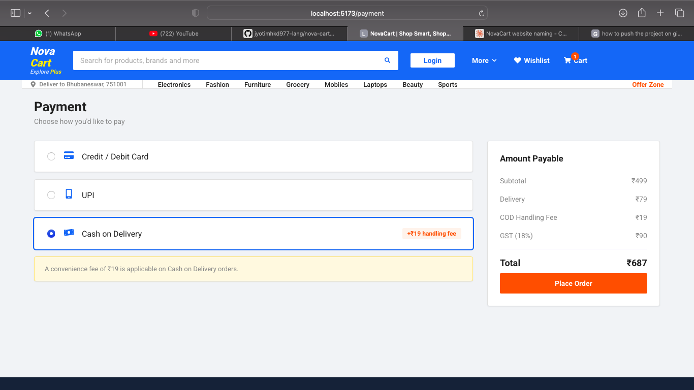
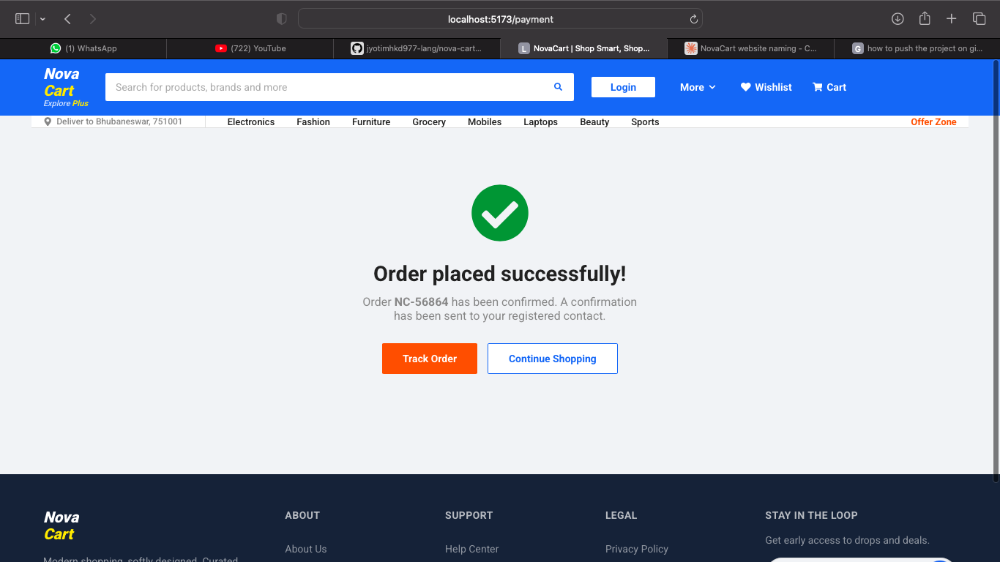
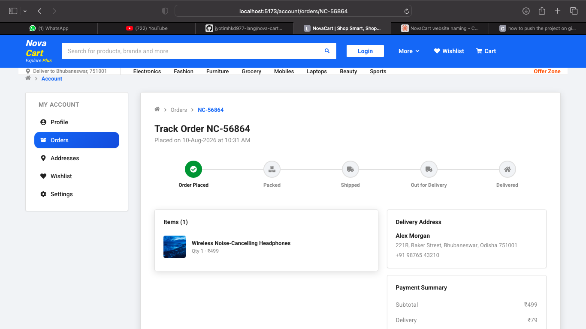

# NovaCart 🛍️

A fully responsive, frontend-only e-commerce storefront built with React.js — styled after Flipkart's UI (blue navbar, orange CTAs, flat sharp-cornered cards) — with nested routing, a simulated products API, coupon codes, address management, and order tracking. No backend required.

## Screenshots

| Home | Cart |
|---|---|
|  |  |

| Checkout — Address & Delivery | Payment — Card |
|---|---|
|  |  |

| Payment — Cash on Delivery | Order Success |
|---|---|
|  |  |

| Order Tracking |
|---|
|  |

## Deploying to Vercel

This project is pre-configured for Vercel and includes a `vercel.json` so client-side routing works correctly.

1. Push the project to a GitHub/GitLab/Bitbucket repo (or run `vercel` from the CLI in this folder).
2. In Vercel, import the repo — it will auto-detect **Vite** as the framework.
3. Confirm the settings (these are also set explicitly in `vercel.json`, so they'll apply even if the dashboard defaults differ):
   - **Build Command**: `npm run build`
   - **Output Directory**: `dist`
   - **Install Command**: `npm install`
4. Deploy.

**Why a plain Vite deploy can 404 on Vercel without this:** this is a single-page app using React Router — routes like `/products/electronics` or `/account/orders/NC-123` don't exist as real files on disk. Vercel's static file server returns a 404 for any path it can't find, unless told to fall back to `index.html` and let React Router handle it client-side. The `rewrites` rule in `vercel.json` (`"/(.*)" → "/index.html"`) fixes exactly this — direct links, refreshes, and shared URLs to any nested route now load correctly.

`.nvmrc` and the `engines` field in `package.json` also pin the Node version so the build environment matches what was tested locally.

## Tech Stack

- **React 19** + **Vite**
- **React Router DOM v7** — nested routing (`/products/:category`, `/account/*`, `/account/orders/:id`)
- **Framer Motion** — page transitions, hover states, hero slider, micro-interactions
- **React Icons**
- **React Toastify** — toast notifications
- **Context API** — Cart, Wishlist, Theme (dark mode), Addresses, Orders — all persisted to `localStorage`
- **Lazy loading + Suspense** — every route is code-split

## Getting Started

```bash
npm install
npm run dev       # start dev server at http://localhost:5173
npm run build     # production build → dist/
npm run preview   # preview the production build
```

## What's Included

### Design
- **Flipkart-style UI** — blue (`#2874F0`) navbar with search bar and category strip, orange (`#FB641B`) CTA buttons, flat white product cards with sharp corners, green rating pills, dark navy footer
- Full **dark mode** toggle (persisted)
- Rotating promotional hero banner, skeleton loaders, quick-view modals

### Pages & Flows
- **Home** — hero slider, perks strip, category grid, promo banners, product carousels (popular/new/deals), brand row, testimonials, newsletter
- **Products** — global + per-category listing (`/products/:category`), filters (price, brand, rating), sorting, pagination, quick view
- **Product Details** — gallery, color/quantity selection, specs, related products
- **Cart** — quantity controls, coupon codes, live delivery-charge threshold indicator
- **Wishlist** — move-to-cart, remove
- **Checkout** — select a saved address or **add a new one** inline, choose standard/express delivery
- **Payment** — Card / UPI / Cash on Delivery, with COD handling fee, animated success screen, places a real order
- **Account Dashboard** — nested routes: Profile, Orders (with live tracking), Addresses (add/remove/set default), Wishlist, Settings
- **Order Tracking** (`/account/orders/:id`) — 5-stage visual timeline (Placed → Packed → Shipped → Out for Delivery → Delivered) that auto-progresses based on time elapsed since the order was placed
- **Search** — live navbar suggestions + dedicated search page with recent/popular searches
- **Offers** — flash-sale countdown timer + copyable coupon code cards
- **About / Contact / Help** — static content pages with a working contact form (toast-based) and FAQ accordion
- **404 Page** — animated illustration with quick links home/shop/search
- **Auth UI** — Login / Register (frontend-only, no real authentication)

### Business Rules
- **Delivery charges**: FREE on orders ≥ **₹2,000**, otherwise a flat ₹79 delivery fee (₹149 for express delivery)
- **Cash on Delivery**: adds a **₹19 handling fee**, itemized separately in the payment summary
- **Coupon codes** (see `src/data/coupons.js`):

  | Code | Discount | Minimum Order |
  |---|---|---|
  | `NOVA10` | 10% off | ₹500 |
  | `NOVA20` | 20% off | ₹2,000 |
  | `FLAT150` | ₹150 off | ₹1,500 |
  | `FLAT300` | ₹300 off | ₹3,500 |
  | `WELCOME50` | ₹50 off | ₹300 |
  | `BIGBILLION` | 15% off | ₹5,000 |

## Folder Structure

```
src/
├── assets/            # images, icons, fonts
├── components/        # Navbar, Footer, ProductCard, CategoryCard, etc.
├── layouts/            # MainLayout, AccountLayout
├── pages/              # one folder per route
├── routes/             # AppRoutes.jsx — all route definitions
├── context/            # CartContext, WishlistContext, ThemeContext, AddressContext, OrdersContext
├── hooks/               # useLocalStorage
├── utils/               # formatters, ScrollToTop
├── services/            # productsApi.js (dummy products API), api.js (placeholder REST client)
├── data/                # products.js (mock catalog), coupons.js (coupon codes)
└── App.jsx
```

## Notes on the Dummy API

`src/services/productsApi.js` simulates a real backend on top of the local mock catalog in `src/data/products.js` — every call returns a `Promise` with artificial network latency (`apiGetProducts`, `apiGetProductById`, `apiSearchProducts`, `apiGetFeatured`, `apiGetNewArrivals`, `apiGetDeals`). Home, Products, and Offers pages already call these functions instead of importing static data directly, so pointing the app at a real backend later is a matter of rewriting the internals of this one file.

`src/services/api.js` is a placeholder generic REST client (`get`/`post`/`put`/`delete`) wired to read a `VITE_API_BASE_URL` env variable, ready for whenever a real backend exists.

## Notes on Persistence

Everything below persists across page reloads via `localStorage` (no backend, no login required):
- Cart items
- Wishlist items
- Theme preference (dark/light)
- Saved addresses
- Order history (used for order tracking)

## Known Limitations

- All product/category data is mocked — no real backend or database
- Login/Register are UI-only — no real authentication or session persistence
- Payment (Card/UPI) does not process any real transaction — it's a simulated 1.2s delay then order confirmation
- Order tracking stage is computed automatically from elapsed time, not real courier data
